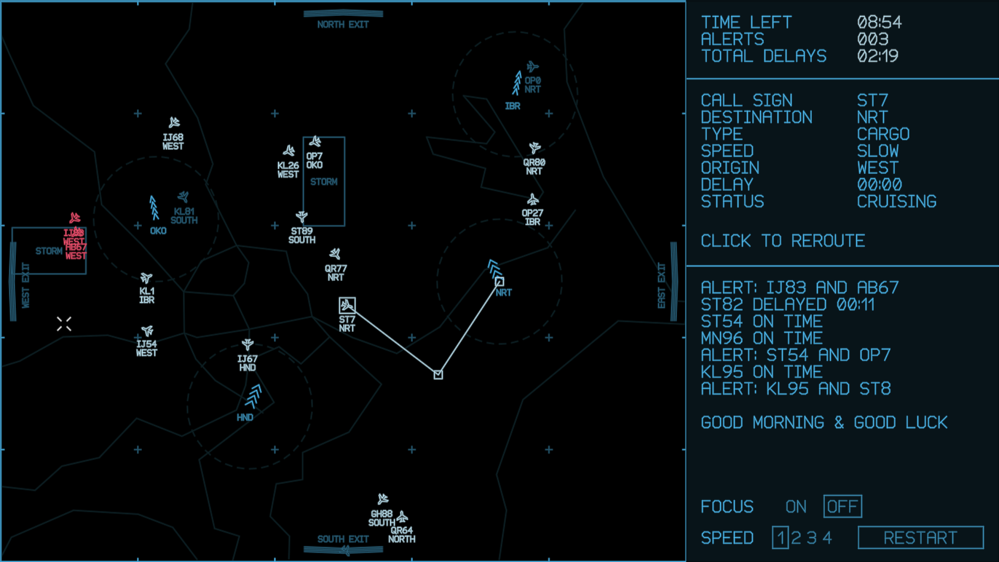

## AIROBICS

A mini-game written solo in 48 hours for Ludum Dare 49 Compo (https://ldjam.com)

https://ldjam.com/events/ludum-dare/49/airobics

### Synopsis

It’s time for your annual retraining as an air traffic controller.

Can you still handle the pressure?

Try to pass a whole day of routing planes to avoid collisions in three different locations.

Controls:
* click plane to select, then click on map to re-route it
* use 1/2/3/4 to change game speed
* F for fullscreen (Windows only)

Written in C++ using raylib targeting, Linux and HTML5. Also used Paint.NET, Aseprite, sfxr, BeepBox and Audacity.

If you'd like to compile the code yourself install raylib 4.0 (with MinGW compiler if on Windows) and use make (or mingw32-make) to build.

### Playable in a browser

https://mausimus.github.io/ld49

### Screenshot

